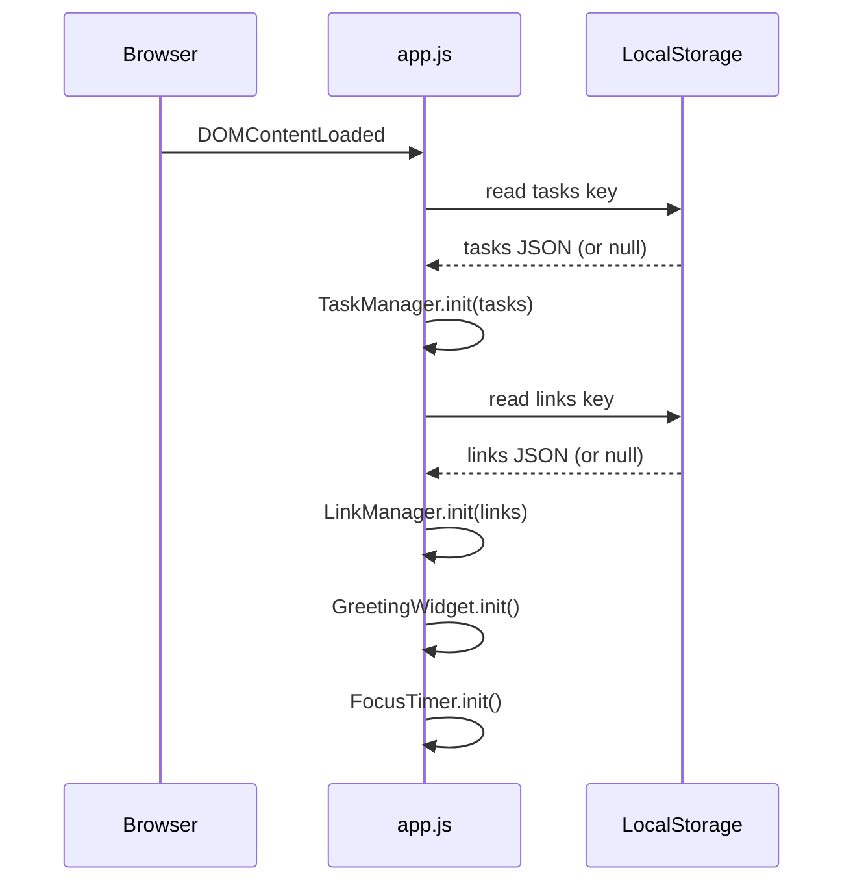

# Design Document — Personal Dashboard

## Overview

The personal dashboard is a fully client-side, single-page web application delivered as a single `index.html` file. It requires no build step, no backend, and no external dependencies — everything runs in the browser. All persistence is handled through the Browser Local Storage API.

The UI is divided into four independent widget sections rendered on one page:

1. **Greeting Widget** — live clock, date, and time-of-day greeting
2. **Focus Timer** — 25-minute countdown with Start / Stop / Reset controls
3. **To-Do List (Task Manager)** — add, edit, complete, and delete tasks
4. **Quick Links (Link Manager)** — add and delete favourite website shortcuts

Each widget owns its own slice of Local Storage and manages its own DOM subtree. A single `js/app.js` module bootstraps all four widgets when the page loads.

---

## Architecture

The application follows a **module-per-widget** pattern inside a single JavaScript file. There is no framework, no virtual DOM, and no bundler — state lives in plain JavaScript objects and is synchronised to Local Storage on every mutation.

```
index.html          — markup skeleton (four widget sections)
css/style.css       — all visual styles, including responsive breakpoints
js/app.js           — all logic: four widget modules + a shared Storage helper
```

### Initialisation Sequence



### Data Flow

```
User interaction
      │
      ▼
Widget handler (pure mutation of in-memory state)
      │
      ├──▶ DOM re-render (widget's render() function)
      │
      └──▶ Storage.save(key, state)   ← only for Task/Link managers
```

---

## Components and Interfaces

### 1. Storage Helper

A thin wrapper around `window.localStorage` used only by `TaskManager` and `LinkManager`.

```js
Storage = {
  save(key: string, value: any): void     // JSON.stringify + setItem
  load(key: string): any | null           // getItem + JSON.parse (returns null on miss/error)
}
```

### 2. GreetingWidget

Responsible for the live clock, date display, and greeting message.

```
GreetingWidget = {
  init(): void           // attaches to DOM, starts tick intervals
  _tick(): void          // called every second via setInterval
  _renderTime(): void    // writes HH:MM:SS (or 12-hour) to the time element
  _renderDate(): void    // writes formatted date string to the date element
  _renderGreeting(): void // computes and writes greeting based on current hour
}
```

- One `setInterval` fires every **1 000 ms** to update the clock.
- Greeting is re-evaluated inside the same tick, satisfying the ≤1-minute re-evaluation requirement.

### 3. FocusTimer

Manages countdown state and button enable/disable logic.

```
FocusTimer = {
  init(): void             // attaches button listeners, renders initial "25:00"
  _start(): void           // starts setInterval(1000), disables Start, enables Stop
  _stop(): void            // clears interval, enables Start, disables Stop
  _reset(): void           // clears interval, restores remaining = 1500, re-renders
  _tick(): void            // decrements remaining; calls _onComplete when 0
  _onComplete(): void      // clears interval, shows notification
  _render(): void          // formats remaining seconds to MM:SS and writes to DOM
}

State:
  remaining: number        // seconds left, 0–1500
  intervalId: number|null  // return value of setInterval, null when stopped
```

### 4. TaskManager

Manages the in-memory task array and its DOM representation.

```
TaskManager = {
  init(tasks: Task[]): void       // populates state, calls render()
  _addTask(label: string): void   // validates, pushes to tasks[], saves, renders
  _editTask(id, label): void      // validates, mutates tasks[], saves, renders
  _toggleTask(id): void           // flips completed flag, saves, renders
  _deleteTask(id): void           // filters tasks[], saves, renders
  _save(): void                   // Storage.save(TASKS_KEY, tasks)
  _render(): void                 // rebuilds task list DOM from tasks[]
}

TASKS_KEY = "pd_tasks"
```

### 5. LinkManager

Manages the in-memory links array and its DOM representation.

```
LinkManager = {
  init(links: Link[]): void        // populates state, calls render()
  _addLink(label, url): void       // validates, pushes to links[], saves, renders
  _deleteLink(id): void            // filters links[], saves, renders
  _save(): void                    // Storage.save(LINKS_KEY, links)
  _render(): void                  // rebuilds link list DOM from links[]
}

LINKS_KEY = "pd_links"
```

---

## Data Models

### Task

```ts
interface Task {
  id: string;           // crypto.randomUUID() or Date.now().toString()
  label: string;        // non-empty, trimmed text
  completed: boolean;   // false on creation
}
```

Serialised as a JSON array under the key `"pd_tasks"` in Local Storage.

Example:
```json
[
  { "id": "1720901234567", "label": "Review PR", "completed": false },
  { "id": "1720901239999", "label": "Write tests", "completed": true }
]
```

### Link

```ts
interface Link {
  id: string;    // crypto.randomUUID() or Date.now().toString()
  label: string; // non-empty display name
  url: string;   // non-empty URL string (user-supplied)
}
```

Serialised as a JSON array under the key `"pd_links"` in Local Storage.

Example:
```json
[
  { "id": "1720901250000", "label": "GitHub", "url": "https://github.com" },
  { "id": "1720901260000", "label": "MDN", "url": "https://developer.mozilla.org" }
]
```

### Storage Keys

| Key | Owner | Value type |
|---|---|---|
| `pd_tasks` | TaskManager | `Task[]` JSON array |
| `pd_links` | LinkManager | `Link[]` JSON array |

---

## Correctness Properties

*A property is a characteristic or behavior that should hold true across all valid executions of a system — essentially, a formal statement about what the system should do. Properties serve as the bridge between human-readable specifications and machine-verifiable correctness guarantees.*

### Property 1: Clock time is always valid

*For any* moment the Greeting Widget renders the time display, the resulting string SHALL match a valid HH:MM:SS or H:MM:SS AM/PM pattern where hours, minutes, and seconds are within their legal ranges.

**Validates: Requirements 1.1**

---

### Property 2: Date string completeness

*For any* moment the Greeting Widget renders the date display, the resulting string SHALL contain a full weekday name, a full month name, a numeric day, and a four-digit year.

**Validates: Requirements 1.2**

---

### Property 3: Greeting correctness covers all hours

*For any* local hour value h in [0, 23], the greeting function SHALL return exactly one of {"Good Morning", "Good Afternoon", "Good Evening"} — "Good Morning" for h ∈ [0, 11], "Good Afternoon" for h ∈ [12, 17], "Good Evening" for h ∈ [18, 23].

**Validates: Requirements 2.1, 2.2, 2.3**

---

### Property 4: Timer display always reflects remaining seconds

*For any* remaining-seconds value r in [0, 1500], the timer render function SHALL produce a string of the form `MM:SS` where the total seconds encoded equals r.

**Validates: Requirements 3.2**

---

### Property 5: Whitespace task labels are rejected

*For any* string composed entirely of whitespace characters (spaces, tabs, newlines), submitting it as a task label SHALL leave the task list unchanged.

**Validates: Requirements 6.3**

---

### Property 6: Valid task addition grows the task list by one

*For any* task list of length n and any non-empty, non-whitespace label, calling `_addTask` SHALL result in a task list of length n + 1 whose last element has the submitted label (trimmed).

**Validates: Requirements 6.2**

---

### Property 7: Task persistence round-trip

*For any* task list state, serialising it to Local Storage and immediately deserialising it SHALL produce an array structurally equal to the original (same ids, labels, and completion flags in the same order).

**Validates: Requirements 9.1, 9.2**

---

### Property 8: Whitespace edits are rejected

*For any* existing task and any edit label composed entirely of whitespace, confirming the edit SHALL leave the task's label unchanged.

**Validates: Requirements 7.4**

---

### Property 9: Completion toggle is an involution

*For any* task with completion flag c, toggling it once SHALL produce ¬c; toggling it a second time SHALL restore c. The task label and id SHALL remain unchanged after both toggles.

**Validates: Requirements 8.2, 8.3**

---

### Property 10: Task deletion removes exactly one task

*For any* task list of length n and any task id that appears exactly once in the list, calling `_deleteTask(id)` SHALL produce a list of length n − 1 that does not contain the deleted id, while all other tasks remain unchanged.

**Validates: Requirements 8.5**

---

### Property 11: Whitespace link fields are rejected

*For any* submission where the label or URL is empty or whitespace-only, calling `_addLink` SHALL leave the links list unchanged.

**Validates: Requirements 10.3**

---

### Property 12: Valid link addition grows the links list by one

*For any* links list of length n and a submission with non-empty label and non-empty URL, calling `_addLink` SHALL result in a links list of length n + 1 whose last element has the submitted label and URL.

**Validates: Requirements 10.2**

---

### Property 13: Link persistence round-trip

*For any* links list state, serialising it to Local Storage and immediately deserialising it SHALL produce an array structurally equal to the original (same ids, labels, and URLs in the same order).

**Validates: Requirements 12.1, 12.2**

---

### Property 14: Link deletion removes exactly one link

*For any* links list of length n and any link id that appears exactly once, calling `_deleteLink(id)` SHALL produce a list of length n − 1 that does not contain the deleted id, while all other links remain unchanged.

**Validates: Requirements 11.2**

---

## Error Handling

| Scenario | Widget | Handling strategy |
|---|---|---|
| `localStorage` unavailable or throws (private/incognito mode with storage blocked) | TaskManager, LinkManager | Wrap `Storage.save` / `Storage.load` in `try/catch`; degrade gracefully — the widget functions in-memory for the session, no crash. |
| Empty / whitespace task label on add | TaskManager | Reject silently; input field retains its content; no DOM change. |
| Empty / whitespace task label on edit confirm | TaskManager | Reject silently; revert to read-only view with original label. |
| Empty label or empty URL on link add | LinkManager | Reject silently; input fields retain their content; no DOM change. |
| Timer reaches 00:00 while interval is still running | FocusTimer | `_onComplete` clears the interval before showing the notification, preventing double-fire. |
| Corrupt JSON in Local Storage (malformed data) | TaskManager, LinkManager | `Storage.load` returns `null` on JSON parse failure; widgets initialise with empty arrays as if no data exists. |
| `crypto.randomUUID()` unavailable (very old browser) | TaskManager, LinkManager | Fall back to `Date.now().toString() + Math.random()` for id generation. |

---

## Testing Strategy

> **Note:** No test framework is required by the project constraints. The testing strategy below describes what tests *would* be written if a test runner were added, and provides guidance for manual verification.

### Widget-level unit tests (example-based)

Each widget module exposes pure helper functions that can be tested in isolation:

- **`getGreeting(hour)`** — verify the three greeting buckets with examples at boundaries: hour 0 → "Good Morning", hour 11 → "Good Morning", hour 12 → "Good Afternoon", hour 17 → "Good Afternoon", hour 18 → "Good Evening", hour 23 → "Good Evening".
- **`formatTime(seconds)`** — verify MM:SS output: `formatTime(1500)` → `"25:00"`, `formatTime(0)` → `"00:00"`, `formatTime(61)` → `"01:01"`.
- **`validateLabel(str)`** — verify whitespace rejection: empty string → false, `"  "` → false, `"\t"` → false, `"Buy milk"` → true.
- **`validateLink(label, url)`** — verify dual-field validation.

### Property-based tests (if a test runner is added)

If [fast-check](https://github.com/dubzzz/fast-check) (JavaScript PBT library) is introduced, each correctness property from the section above maps to one property test configured to run a minimum of **100 iterations**.

Test tagging format:
```
// Feature: personal-dashboard, Property 7: Task persistence round-trip
```

Key properties to prioritise:

- **Property 3** (greeting covers all hours) — `fc.integer({min:0, max:23})` → assert return is one of three strings.
- **Property 4** (timer display) — `fc.integer({min:0, max:1500})` → assert `formatTime(r)` encodes r correctly.
- **Property 5 & 8** (whitespace rejection) — `fc.string().filter(s => s.trim() === '')` → assert no mutation.
- **Property 6** (task addition) — `fc.array(taskArb)` + `fc.string().filter(s => s.trim() !== '')` → assert length + 1.
- **Property 7 & 13** (round-trip) — `fc.array(taskArb)` / `fc.array(linkArb)` → assert `JSON.parse(JSON.stringify(x))` deep-equals x.
- **Property 9** (toggle involution) — `fc.boolean()` for initial state → assert double-toggle restores state.
- **Property 10 & 14** (deletion) — `fc.array(arb, {minLength:1})` → pick random id, assert length − 1 and id absent.

### Integration / manual verification checklist

- [ ] Dashboard loads in Chrome, Firefox, Edge, and Safari without console errors.
- [ ] Greeting updates at the midnight → morning and 18:00 → evening boundaries.
- [ ] Timer counts to 00:00 and fires the completion notification exactly once.
- [ ] Tasks survive a full page reload (Local Storage round-trip).
- [ ] Quick links open in a new tab.
- [ ] Layout renders correctly at 320 px, 768 px, 1280 px, and 2560 px viewport widths.
- [ ] `localStorage` blocked in private mode: widgets still render, no uncaught exception.
